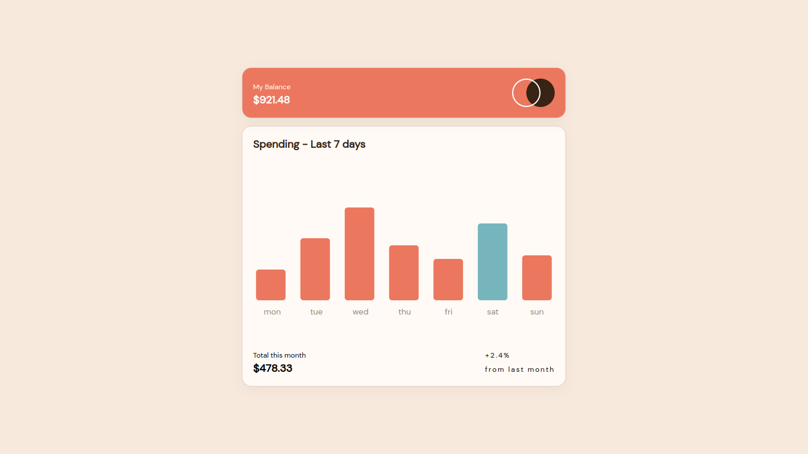

# Overview

Expense Chart is a Simple FrontEnd SPA Displaying a Graphical Interface for Weekly Consumption Cost . It Indicates the amount spent on Each Day on Hover as well as Highlight the cost for that day in Blue based on the current Day .

### Screenshot

;

### Links

- Solution URL: [https://github.com/jerncomania28/expense-chart](https://github.com/jerncomania28/expense-chart)
- Live Site URL: [https://ornate-chebakia-b994d1.netlify.app/](https://ornate-chebakia-b994d1.netlify.app/)

### Built with

- Semantic HTML5 markup
- Flexbox
- SCSS/Sass
- Mobile-first workflow
- [React](https://reactjs.org/) - JS library
